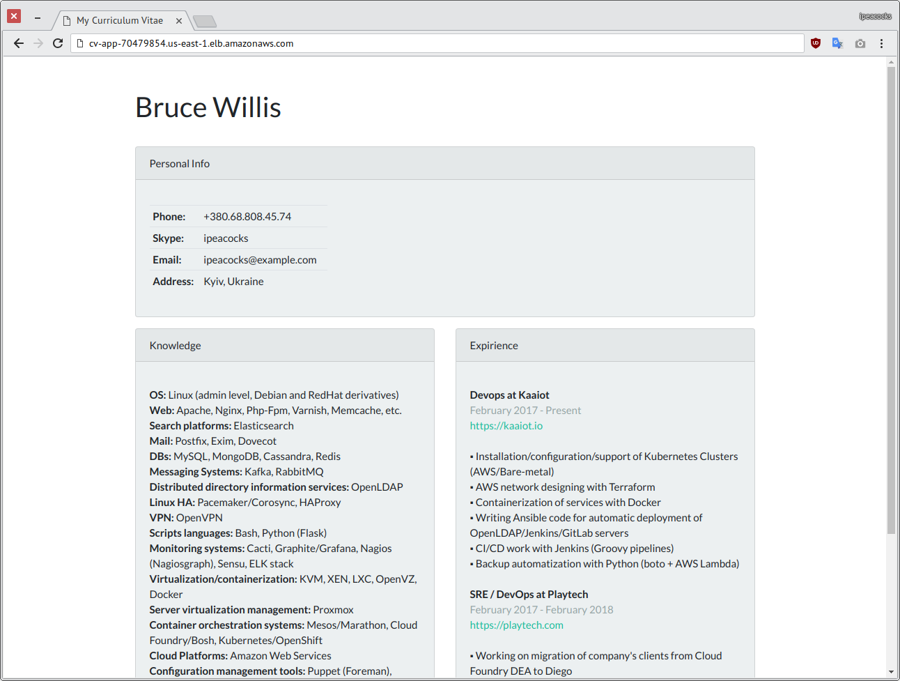

# Curriculum Vitae App

In these folders you can find all needed files and instructions for deploying CV app to AWS ECS infrastructure:
* `docker` - all docker stuff
* `terrafrom` - terrafrom templates
* `app` - CV app (Flask/Bootstrap 4)

  

